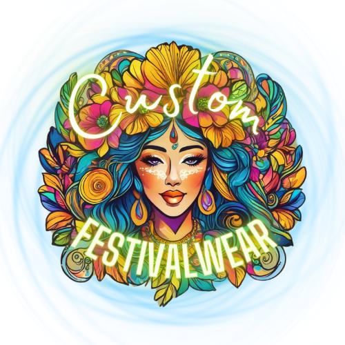
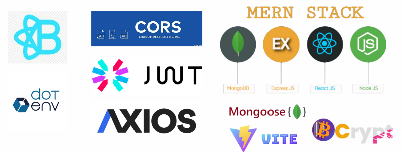

# music-festival-hub

[](https://opensource.org/licenses/mit)

## www.customfestivalwear.ca



## Description

customfestivalwear.ca is the ultimate destination for connecting with fellow festival enthusiasts and unleashing your personal creativity! Our colorful platform will soon offer a unique U-Design feature and a vibrant social networking experience where users can share festival tips, favorite artists, fashion inspirations and catch all the latest festival news and updates worldwide!

## Table of Contents

- [Description](#description)
- [Getting Started](#getting-started)
- [User Story](#user-story)
- [Acceptance Criteria](#acceptance-criteria)
- [Built-With](#built-with)
- [Credits](#credits)
- [Questions](#questions)
- [Links](#links)
- [License](#license)

## Getting Started

### Installation Instructions

- Follow these steps to set up and run the application locally.

#### Prerequisites

- Before you begin, ensure you have met the following requirements:

  - Node.js installed (version 12.x or higher recommended)
  - npm (Node Package Manager) installed
  - Nodemon installed
  - MongoDB installed and running locally or access to a MongoDB Atlas cluster

#### Setting Up Your Project

- To set up the project, follow these steps:

1. Clone the repository

2. Install dependencies

    - Navigate to the project directory and run: `npm install`

3. Set up environment variables

    - Create a .env file in the root of your project directory. Add the necessary environment variables as specified in the .env.Example file provided in the project.
    
    - Make sure to replace the placeholder values with your actual data. For example:

```code
PORT=3000
MONGODB_URI=mongodb://localhost:27017/yourdatabasename
JWT_SECRET=your_secret_here
```

4. Start the MongoDB server and seed the database

    - Ensure your MongoDB server is running. If you're using a local MongoDB server, you can start it with: `mongod`

    - Next, seed the database with the provided seed data: `npm run seed`

    - If you're using MongoDB Atlas, ensure your connection string in the .env file matches your cluster's connection details.

5. Run the application

    - To start the application, run: `npm start`

    - This will start the server on the port specified in your .env file (or port 3000 by default). You can access the application by navigating to [localhost:3000](http://localhost:3000) in your browser.

#### Development

- For development, you might want to run the application in development mode with nodemon for automatic server restarts on code changes: `npm run dev`

- Ensure you have `nodemon` installed globally or as a dev dependency in your project.

## User Story

AS A festival vendor and enthusiast

I WANT a one-stop shop to buy festival merch, buy tickets, connect with festival friends, design my own looks, post my own photos and experiences and get the latest updates

SO THAT I can stay up to date with festivals and friends across the globe

## Acceptance Criteria

**Main**

GIVEN this is a festival minded application

WHEN I see the customfestivalwear.ca logo of the main page

THEN A photo carousel will start to rotate through Best Sellers

WHEN I click on a shortcut button

THEN I am directed to either festival event news, festival tricks, tips and hacks or an amazon store specialized in festival gear.

**Register**

WHEN I click register

THEN I am brought to the registration page that asks my name, email and for a password to be created

WHEN click submit

THEN I am automatically brought to my profile page

**Profile**

WHEN I go to the Profile page

THEN I can add and update sections name, username, about me, favorite festival and a place to upload their profile image

WHEN I am happy with my profile i can click submit to save

THEN if i change my mind I can click delete

**Admin**

WHEN I go to Admin Page

THEN I can see a product form where i am able to update price, title, description, stock and add or delete items

WHEN I scroll to the bottom

THEN I see a Users form where i am able to update and delete users

**Art Market**

WHEN I go to The Art Market

THEN I can click on each drop down menu searching by style, size or bestsellers

WHEN I find the item I want to purchase

THEN I click the Add to Cart Button to purchase

THEN  I am brought to the checkout form

WHEN I add my personal and payment information and click submit

THEN I am brought to the Order Confirmation Modal  that displays my cart items plus tax and shipping and the personal and payment information with a randomly generated order confirmation number

## Built-With



-[Stripe](https://docs.stripe.com/payments?payments=popular) (Future Development)

**Assets**

Color Pallette from Coolors


Socials for Site: [Facebook ](https://https://www.facebook.com/customfestivalwear) (Future Development)

Artwork & Presentation: [Canva](https://www.canva.com/)

## Credits

This app was created by [CookingMeister](https://github.com/CookingMeister),
[SamGreenwood84](https://github.com/SamGreenwood84) and [Samamiraa](https://github.com/samamiraa) on criteria from the University of New Brunswick's [edX Coding Bootcamp program](https://www.unb.ca/cel/career/index.html).
Program materials,[MDN Web Docs](https://developer.mozilla.org/en-US/docs/Learn/Tools_and_testing/Client-side_JavaScript_frameworks/React_getting_started), [W3Schools](https://www.w3schools.com/), [stackOverflow.com](https://stackoverflow.com/) and [React Router](https://reactrouter.com/en/main) documentation were referenced for this app.
Tasks were organized using [Trello](https://trello.com).

## Questions

If you have an questions about this app, please contact CookingMeister at [LinkedIn](https://www.linkedin.com/in/shawn-meister-bb646b29a/), SamGreenwood84 at [LinkedIn](https://www.linkedin.com/in/) or Samamiraa at [LinkedIn](https://www.linkedin.com/in/). More of our work can be viewed by clicking on our names above in the [Credits](#credits) section.

## Links

- Deployed App on render.com: [Click Here!](https://render.com/)

- GitHub Repo [Click Here!](https://github.com/CookingMeister/music-festival-hub.git)

- Google Drive Demo Video: [Click Here!]( https://)

- Canva presentation: [Click Here!](https://www.canva.com/design/DAGCJ5D603k/A4Iv53Xum715XocP2SlybQ/edit?utm_content=DAGCJ5D603k&utm_campaign=designshare&utm_medium=link2&utm_source=sharebutton)


## License

[](https://opensource.org/licenses/mit)

This project is licensed under the [MIT License](LICENSE).

&copy; 2024
