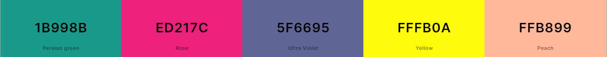

# music-festival-hub

A MERN stack app for a musical festival hub

# www.customfestivalwear.ca
Custom Festivalwear is the ultimate destination for connecting with fellow festival enthusiasts and unleashing your personal creativity! 

**Final Project**

# Description

customfestivalwear.ca is the ultimate destination for connecting with fellow festival enthusiasts and unleashing your personal creativity! Our colorful platform offers a unique U-Design feature and a vibrant social networking experience where users can share festival tips, favorite artists, fashion inspirations and catch all the latest festival news and updates worldwide! 

# Table of Contents

- [Live Demo](#live-demo)
- [Getting Started](#getting-started)
- [User Story](#user-story)
- [Acceptance Criteria](#acceptance-criteria)
- [Built-With](#built-with)
- [Collaboration](#collaboration)
- [Deployment](#deployment)
- [License](#license)

# Live Demo Video

# Getting Started

1. 
2. 
3. 
4. 

# User Story

AS A festival vendor and enthusiast

I WANT a one-stop shop to buy festival merch, buy tickets, connect with festival friends, design my own looks, post my own photos and experiences and get the latest updates

SO THAT I can stay up to date with festivals and friends across the globe

# Acceptance Criteria

GIVEN  this is a festival driven social application

WHEN I see the customfestivalwear logo of the main page

THEN A photo carousel will start to rotate through available products

WHEN I click on the image  

THEN it will display the item title, size and description

WHEN I click on a shortcut button 

THEN I am directed to either festival event news, festival tricks, tips and hacks or an amazon store specialized in festival gear.

WHEN I go to the marketplace

THEN I can click on each drop down menu searching by style, size or bestsellers

WHEN I find the item I want to purchase 

THEN I click the Add to Cart Button to purhcase 

WHEN I click on the nav bar link Profile 

THEN I am directed to my profile that shows my picture, name, username, favourite festivals, my socials and my spotify playlists.

WHEN I click on Albums

THEN I am am able to view, add, delete or create albums by uploading my photos

WHEN I tag them as public 

THEN the photos are circulated through the public album on the mainpage

WHEN I tag them as private

THEN the photo remain on the profile page albums only viewed by me

WHEN I click on the bulliten board 

THEN I see the top posts made by people in the network and my festival friends

WHEN I want to add a friend 

THEN I can use the search bar to type in their name or username if they are part of the network

WHEN I see they are not part of the network 

THEN I can send them an email invite to join customfestivalwear.ca

WHEN I find my friend

THEN I can click the add friend button and they will be added to your personal network and your feed will cycle through all your friends posts along with the tops posts from anyone in the network

WHEN I see a post I like 

THEN I can click on the like button and/or the comment button and click submit to post the comment

WHEN I want to post text or a photo 

THEN I click add post to upload my photo or write my text using hashtags to organize my post

WHEN I click on the nav bar link Design

THEN I am brought to a page with ai-assisted u-design where I use a paint application to desgin clothing, shoes or accessories only assisted by AI, I see a carousel album of outfits already posted by users, a text box to assist the AI using a MAX 50 characters and a box where my image will be generated

WHEN I am happy with my drawing

THEN I will give a short descriptor (example:make it rainbow, sparkly on brunette female= 43 characters with spaces) and click submit

WHEN the AI is done generating the image

THEN it will display in the frame and will be asked to tag public or private

WHEN I choose public 

THEN the image will be circulated through on the album in the bottom corner carousel for the public 

WHEN I choose private

THEN it will populate in my U-Design Album on your profile page only for me to view

WHEN I click the main link on the nav bar

THEN I will be brought back tot he main page with the public albums, available products and news links

# Built-With

-MongoDB

-Mongoose

-dotenv

-express.js

-[Stripe](https://docs.stripe.com/payments?payments=popular)

**Assets**

Color Pallette from Coolors

Socials for Site: [Facebook ](https://https://www.facebook.com/customfestivalwear) 

Artwork: 

# Collaboration

Bootcamp Spot Module 18-21

Team: Samantha Allen, Shawn Meister and Sam Greenwood

Trello

# Deployment

GitHub Repository Link [Click Here!](https://github.com/CookingMeister/music-festival-hub.git)

For Google Drive Link: [Click Here!]( https://)

# License

MIT License

Copyright (c) 2024 